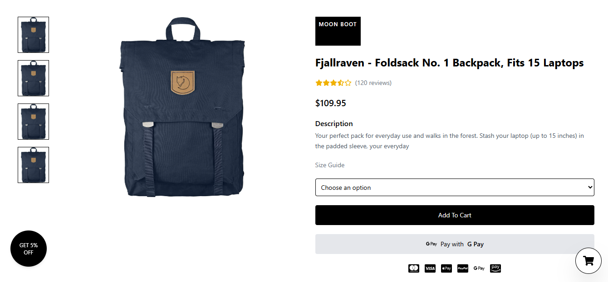

# 🛍️ React Fake Store App

A clean architecture React + TypeScript application using **React Query**, **Zustand**, and the **Fake Store API**.

---

## ⚙️ Tech Stack

- React + TypeScript
- React Router DOM
- React Query (@tanstack/react-query)
- Zustand (state management)
- Axios (API calls)
- TailwindCSS (optional styling)

---

## 📦 Features

- Products list page
- Individual product detail
- Add to cart
- Cart item quantity updates
- Total price calculation
- Global cart state with Zustand
- Data fetching with React Query

---

## 🚀 Getting Started

### 1. Clone the Repo
```bash
git clone https://github.com/your-username/react-clean-fake-store.git
cd react-clean-fake-store
```

### 2. Install Dependencies
```bash
bun install
```

### 3. Start the App
```bash
bun run dev
``` 

### 4. Open in Browser
http://localhost:3000

## 📸 Screenshots

### 🏠 Home Page


### 📄 Product Detail Page



### 📱 Mobile Views


---